# ESP32 IoT Sensor Node — BMP180 · DHT11 · ThingSpeak

**English** | [Tiếng Việt](README.vi.md)

ESP-IDF firmware for ESP32 that samples a BMP180 (temperature, pressure, altitude) and a DHT11
(humidity, temperature), filters the signals, packs each period into one data object, queues it
in a fixed-size pool and uploads it to ThingSpeak. Wi-Fi and ThingSpeak are configured from a
web page served by the device itself.

The document is organised like an Automotive SPICE software work product: requirements first,
then the architecture that fulfils them, then the detailed design of each component.

| Section | Answers |
|---|---|
| [1. Quick start](#1-quick-start) | How do I build, flash and use it? |
| [2. Software requirements](#2-software-requirements) | *What* must the software do? |
| [3. Software architecture](#3-software-architecture) | *Which* components, tasks and interfaces? |
| [4. Detailed design](#4-detailed-design) | *How* does each component work? |
| [5. Configuration reference](#5-configuration-reference) | Which parameters can be changed? |

> [!TIP]
> Diagrams are written in Mermaid. GitHub/GitLab render them natively. In VS Code install the
> extension **Markdown Preview Mermaid Support** (`bierner.markdown-mermaid`) and open the preview
> with `Ctrl+Shift+V`.

---

## 1. Quick start

### 1.1 Hardware

| Part | Signal | ESP32 GPIO (default) |
|---|---|---|
| BMP180 | SDA / SCL | 25 / 26 |
| DHT11 | DATA | 32 |
| Status LED | on-board blue LED | 2 |

Sensors are powered from **3V3**. The board draws up to ~500 mA when the Wi-Fi radio starts; a weak
USB cable/port triggers `Brownout detector was triggered` and a reboot loop.

### 1.2 Build and flash

```bash
. ~/esp/esp-idf-v5.5.5/export.sh                 # ESP-IDF v5.5.x
cp sdkconfig.secrets.example sdkconfig.secrets   # fill in API key / default Wi-Fi (git-ignored)
rm -f sdkconfig && idf.py set-target esp32
idf.py build
idf.py -p /dev/ttyUSB0 -b 460800 flash monitor
```

### 1.3 First use


| LED pattern | Meaning |
|---|---|
| 0.5 s on · 1 s off | Not connected to a Wi-Fi network |
| 1 s on · 2 s off | Connected, has an IP address |

---

## 2. Software requirements

### 2.1 Requirements

| ID | Requirement |
|---|---|
| **SWR-01** | The device shall always run a configuration access point `IOT_Device` (open) with static IP `192.168.1.14/24`, independent of the station connection. |
| **SWR-02** | Every web page and API shall require HTTP Basic Auth (default `admin`/`admin`). |
| **SWR-03** | The web UI shall scan and list nearby Wi-Fi networks; selecting one shall ask for its password and connect. Hidden networks can be entered manually. |
| **SWR-04** | Wi-Fi credentials shall be stored in NVS and used after reboot. The station shall reconnect automatically 5 s after a connection loss. |
| **SWR-05** | The status LED shall blink 0.5 s on / 1 s off while disconnected and 1 s on / 2 s off while connected. |
| **SWR-06** | The station IP shall be printed on the UART log when obtained and repeated every 60 s. |
| **SWR-07** | ThingSpeak parameters (enable, channel ID, write API key, period 5–3600 s) shall be editable on the web and stored in NVS. |
| **SWR-08** | The web UI shall offer *reboot* and *factory reset* (erase stored configuration). |
| **SWR-09** | The web UI shall work on phone and desktop browsers without Internet access (no CDN). |
| **SWR-10** | Sampling shall be driven by a hardware timer ISR and task events. At the end of every period the readings of **both** sensors shall be packed into **one** data object. |
| **SWR-11** | Each measured channel shall be filtered (range check → median of 5 → EMA) to remove spikes while keeping a constant lag on rising/falling ramps. |
| **SWR-12** | Data objects shall be queued in a fixed pool of 32. When the pool is full the **oldest** object shall be dropped so data stays fresh. |
| **SWR-13** | An upload worker shall be woken every 1 s by the timer ISR and on new data, respect the ThingSpeak limit of one update per 15 s, and upload all pending objects with their real measurement time. |
| **SWR-14** | A build option shall replace sensor reads with a synthetic rising/falling signal for testing without hardware. |

### 2.2 Constraints and decisions

| ID | Decision | Reason |
|---|---|---|
| DEC-01 | Wi-Fi provisioning only through the web UI; SmartConfig removed. | Product decision, keeps one configuration path. |
| DEC-02 | AP stays on in APSTA mode even after the station connects. | Web page always reachable. lwIP source-based routing lets the AP subnet overlap a `192.168.1.x` home network. |
| DEC-03 | Upload uses ThingSpeak **bulk update** with `created_at`. | Free accounts accept one update per 15 s; bulk upload avoids data loss when the period is shorter or the network was down. |
| DEC-04 | Field mapping is hard-coded for now (`FIELD_MAP`). | Web-configurable mapping is planned. |
| DEC-05 | Secrets (API key, default Wi-Fi) live in git-ignored `sdkconfig.secrets`. | No credentials in the repository. |

---

## 3. Software architecture

### 3.1 System context

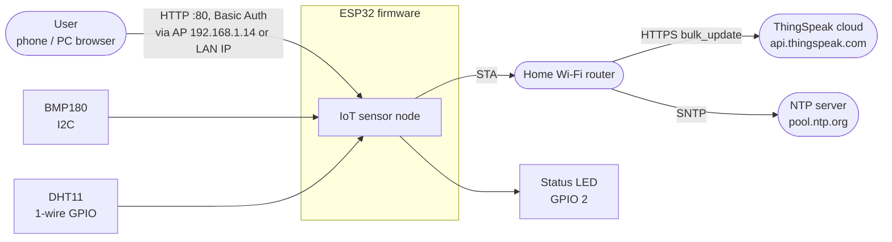

### 3.2 Static view — components and layers

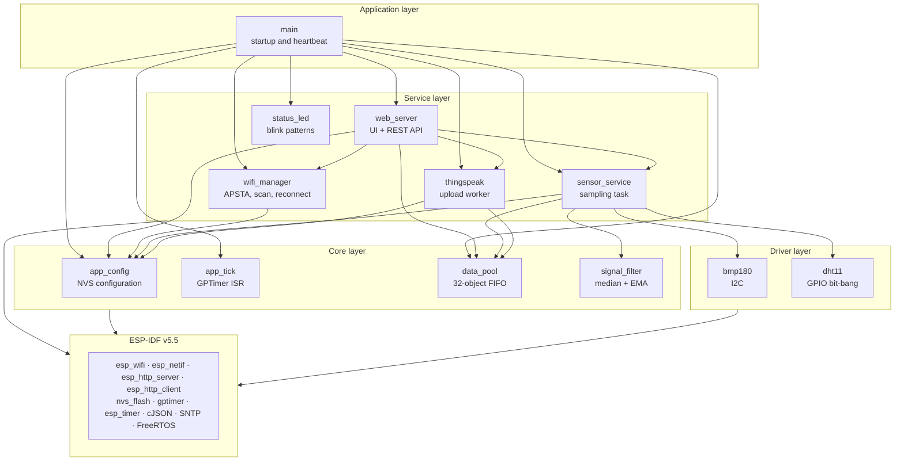

| Component | Responsibility | Main interface |
|---|---|---|
| `main` | Initialise components in order, wire callbacks, heartbeat log every 60 s | `app_main()` |
| `app_config` | Load/save Wi-Fi and ThingSpeak settings in NVS, defaults from Kconfig | `app_config_get_*/set_*`, `app_config_factory_reset` |
| `app_tick` | Hardware GPTimer, ISR notifies subscribed tasks | `app_tick_subscribe`, `app_tick_start` |
| `sensor_service` | Read sensors every tick, filter, pack one object per period | `sensor_service_start`, `sensor_service_get_latest` |
| `signal_filter` | Per-channel range check → median-5 → EMA | `signal_filter_update/get/reset` |
| `data_pool` | Static ring buffer of 32 `sensor_sample_t`, drop-oldest | `data_pool_push/peek/release/get_stats` |
| `thingspeak` | Upload worker, SNTP, bulk/single update | `thingspeak_worker_start`, `thingspeak_get_status` |
| `wifi_manager` | APSTA, static AP IP, reconnect timer, scan, connect | `wifi_manager_start/connect/scan/get_status` |
| `web_server` | Embedded single-page UI and REST API with Basic Auth | `web_server_start` |
| `status_led` | Blink pattern driven by `esp_timer` | `status_led_set_mode` |
| `bmp180`, `dht11` | Sensor drivers | `bmp180_read_*`, `dht11_read` |

### 3.3 Dynamic view — tasks and events

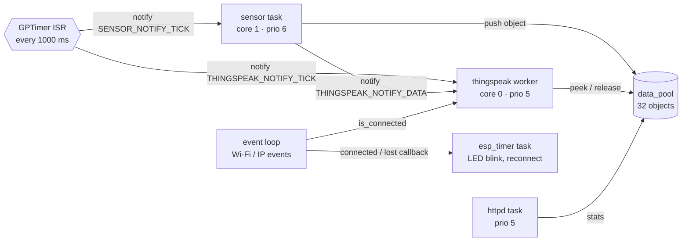

| Execution context | Core | Priority | Stack | Woken by |
|---|---|---|---|---|
| GPTimer ISR (`app_tick`) | — | ISR | — | Hardware alarm every `APP_TICK_PERIOD_MS` |
| `sensor` task | 1 | 6 | 4 KB | `SENSOR_NOTIFY_TICK` |
| `thingspeak` task | 0 | 5 | 8 KB | `THINGSPEAK_NOTIFY_TICK` \| `THINGSPEAK_NOTIFY_DATA` |
| `httpd` task | — | 5 | 8 KB | HTTP request |
| Default event loop | 0 | 20 | IDF | Wi-Fi / IP events (`wifi_manager` handler) |
| `esp_timer` task | 0 | 22 | IDF | LED blink, 5 s reconnect timer, reboot timer |
| `main` task | 0 | 1 | IDF | Heartbeat every 60 s |

> [!NOTE]
> The sensor task runs on **core 1** because the DHT11 frame is read inside a critical section
> (~4.5 ms, interrupts off on that core). Wi-Fi interrupts stay on core 0 and are not delayed.

### 3.4 Shared resources

| Resource | Writers | Readers | Protection |
|---|---|---|---|
| `data_pool` ring buffer | sensor task | worker, httpd | FreeRTOS mutex |
| Configuration cache | httpd | sensor, worker, wifi_manager | FreeRTOS mutex |
| Latest sample | sensor task | httpd | spinlock |
| Wi-Fi status | event loop, httpd | worker, httpd, main | spinlock |
| ThingSpeak status | worker | httpd | spinlock |
| Scan / connect operations | httpd | — | mutex (`s_op_lock`) |

### 3.5 Boot sequence

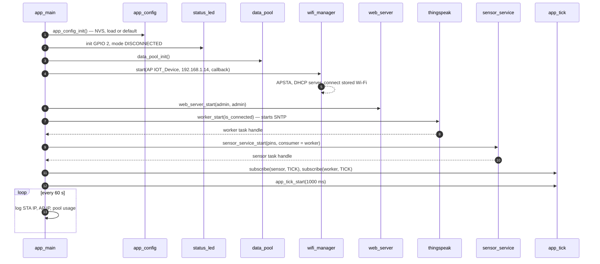

### 3.6 End-to-end data flow

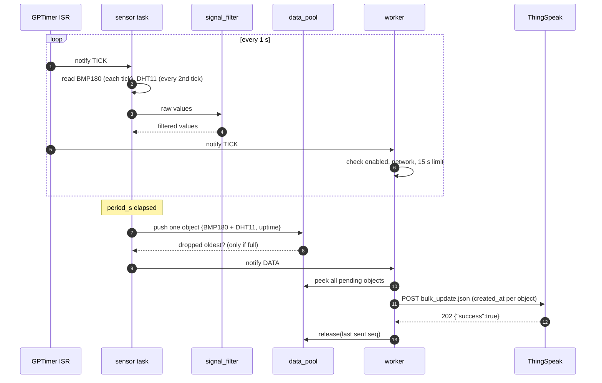

---

## 4. Detailed design

### 4.1 `app_tick` — timing source

- One GPTimer at 1 MHz resolution, auto-reload alarm at `period_ms × 1000` counts.
- ISR `tick_isr()` calls `xTaskNotifyFromISR(task, bits, eSetBits)` for up to 4 subscribers and
  yields if a higher-priority task was woken.
- No work is done in the ISR; I2C, DHT11 and HTTP run in tasks.

### 4.2 `sensor_service` — sampling per tick

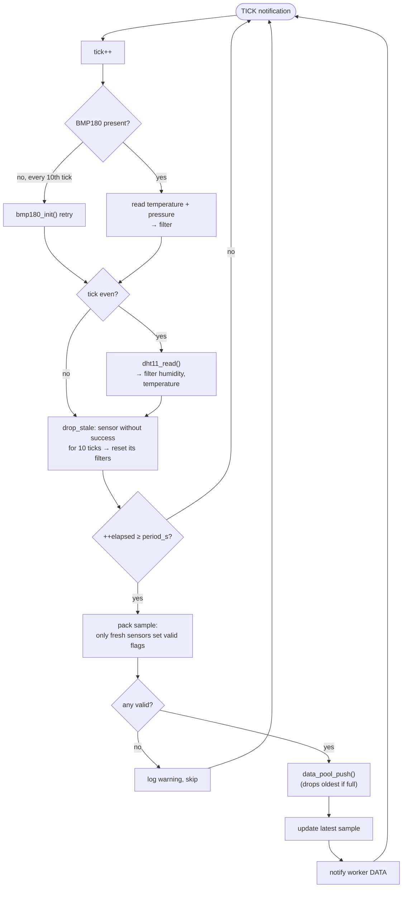

Data object (`sensor_sample_t`, `lib/data_pool/data_pool.h`):

| Field | Unit | Source |
|---|---|---|
| `seq` | — | Assigned by the pool, strictly increasing |
| `uptime_us` | µs | `esp_timer_get_time()` at pack time |
| `valid` | bit mask | `SAMPLE_VALID_BMP180`, `SAMPLE_VALID_DHT11` |
| `bmp_temperature_c` | °C | BMP180, filtered |
| `pressure_hpa` | hPa | BMP180, filtered |
| `altitude_m` | m | from filtered pressure and sea-level reference |
| `humidity_percent` | %RH | DHT11, filtered |
| `dht_temperature_c` | °C | DHT11, filtered |

**Fake data mode** (`CONFIG_APP_SENSOR_FAKE_DATA`): the sensor reads are replaced by a triangle wave
with a 120-tick cycle — temperature 20 → 35 → 20 °C, pressure 1000 → 1020 hPa, humidity 40 → 80 %RH,
DHT temperature = temperature − 0.5 °C. Small noise (±0.1 °C, ±5 Pa, ±0.3 %RH) and a spike every
25 ticks (+8 °C, +400 Pa, +5 %RH) are added. The values go through the same filters.

### 4.3 `signal_filter` — noise filter

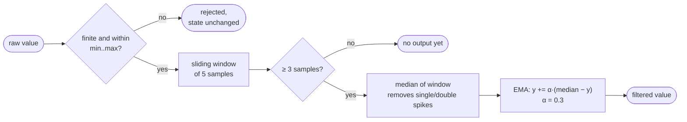

| Channel | Valid range | α |
|---|---|---|
| BMP180 temperature | −40 … 85 °C | 0.3 |
| BMP180 pressure | 30 000 … 110 000 Pa | 0.3 |
| DHT11 temperature | 0 … 50 °C | 0.3 |
| DHT11 humidity | 0 … 100 %RH | 0.3 |

On a linear ramp the median adds 2 samples of delay and the EMA ≈ 2.3 samples, so the output is a
parallel, delayed copy of the input (≈ 1.1 °C behind at a slope of 0.25 °C/sample, identical on
rising and falling edges).

### 4.4 `data_pool` — drop-oldest FIFO

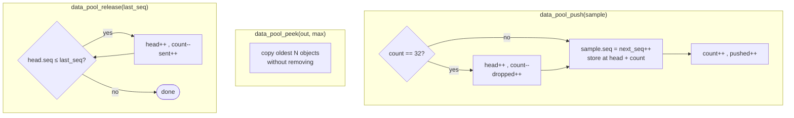

- Static storage, no `malloc`. All operations are guarded by one mutex.
- `peek` + `release(seq)` lets the worker send without holding the lock during HTTP. Objects dropped
  while a request is in flight are handled correctly because release compares sequence numbers.

### 4.5 `thingspeak` — upload worker

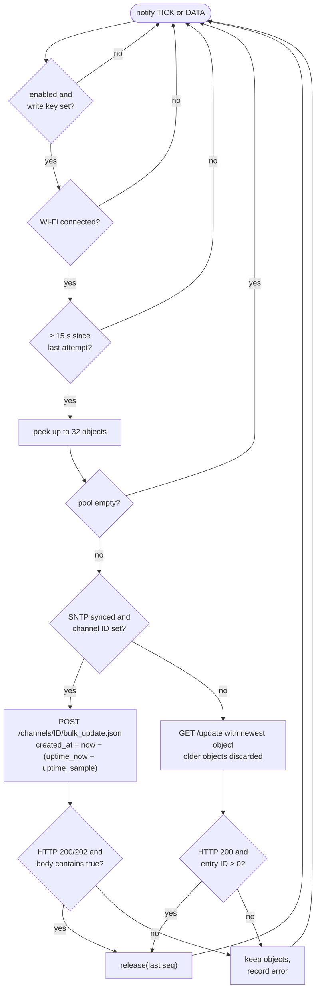

Field mapping (`FIELD_MAP` in `lib/thingspeak/thingspeak.c`):

| ThingSpeak field | Value |
|---|---|
| field1 | BMP180 temperature (°C) |
| field2 | Pressure (hPa) |
| field3 | DHT11 humidity (%RH) |
| field4 | DHT11 temperature (°C) |

Fields of an invalid sensor are omitted from the update.

### 4.6 `wifi_manager` — station state machine

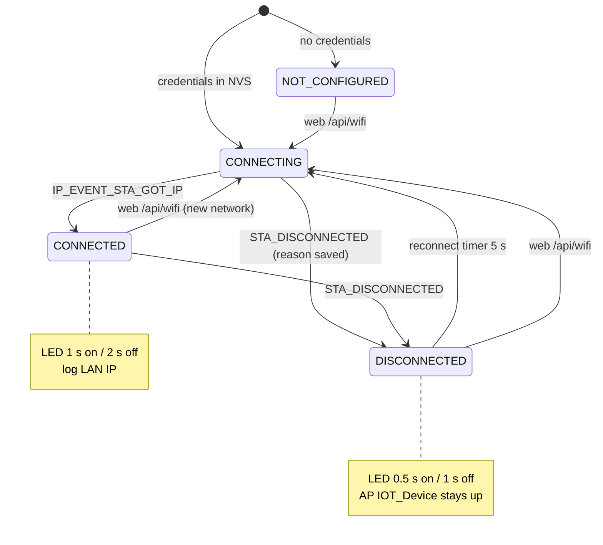

- The AP interface is configured before `esp_wifi_start()`: DHCP server stopped, static IP set,
  DHCP server restarted.
- **Scan**: when not connected the reconnect loop is paused (driver rejects scans while
  connecting), the scan runs blocking (~3 s), then reconnect resumes.
- **Connect from web**: credentials are saved to NVS first, the current link is dropped and the
  code waits for the disconnect event (≤ 1 s) so the old event cannot schedule a stale reconnect.

Provisioning sequence from the web UI:

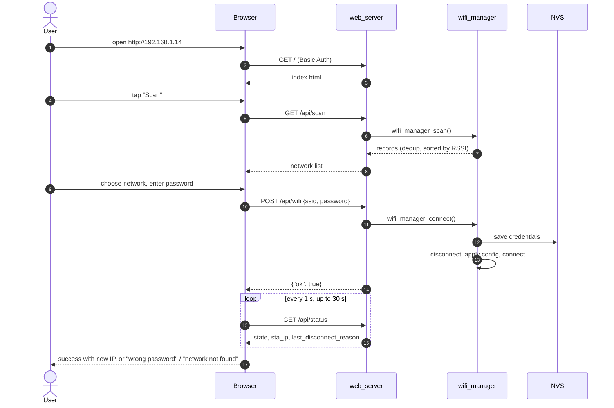

### 4.7 `web_server` — REST API

All URIs require `Authorization: Basic …`; otherwise `401` with `WWW-Authenticate` so the browser
shows its login dialog. Request bodies are limited to 512 bytes.

| Method | URI | Body / result |
|---|---|---|
| GET | `/` | Embedded `index.html` (~19 KB, no external resources) |
| GET | `/api/status` | Wi-Fi, latest sensor object, pool stats, ThingSpeak status, uptime, free heap |
| GET | `/api/scan` | `[{ssid, rssi, channel, secure}]`, max 20, strongest first |
| POST | `/api/wifi` | `{ssid, password}` — password empty or 8–64 chars |
| GET | `/api/thingspeak` | `{enabled, channel_id, write_api_key, period_s, min/max_period_s, min_send_interval_s}` |
| POST | `/api/thingspeak` | Same fields; missing fields keep their value; `400` if invalid |
| POST | `/api/reboot` | Restart after 1 s |
| POST | `/api/factory-reset` | Erase `app_cfg` NVS namespace, restart after 1 s |

### 4.8 `app_config` — persistent configuration

| NVS namespace `app_cfg` | Type | Content |
|---|---|---|
| `wifi` | blob | `app_wifi_config_t {ssid[33], password[65]}` |
| `thingspeak` | blob | `app_thingspeak_config_t {enabled, channel_id, write_api_key[17], period_s}` |

Priority: **NVS value → Kconfig default (`sdkconfig.secrets`) → built-in default**. The write key
must be alphanumeric because it is placed in the request URL.

### 4.9 `status_led` and `dht11`

- `status_led`: one `esp_timer` one-shot re-armed with the on/off time of the current pattern. A
  mode change restarts the pattern from the timer task, so the GPIO is never toggled concurrently.
- `dht11`: the 18 ms start pulse runs with interrupts enabled; the response and the 40 data bits
  (~4.5 ms) are read inside `portENTER_CRITICAL` so Wi-Fi interrupts cannot stretch the pulse
  timing. Checksum is verified after leaving the critical section.

---

## 5. Configuration reference

`idf.py menuconfig` → **IoT Device Configuration** (real values go into `sdkconfig.secrets`):

| Option | Default | Description |
|---|---|---|
| `APP_AP_SSID` | `IOT_Device` | Configuration AP name (open) |
| `APP_AP_IP` | `192.168.1.14` | AP static IP, /24 |
| `APP_WEB_USERNAME` / `APP_WEB_PASSWORD` | `admin` / `admin` | Web login |
| `APP_STATUS_LED_GPIO` | `2` | Status LED |
| `APP_DEFAULT_PERIOD_S` | `20` | Sampling = upload period (5–3600 s) |
| `APP_DEFAULT_TS_ENABLED` / `_CHANNEL_ID` / `_WRITE_KEY` | off / 0 / empty | ThingSpeak defaults |
| `APP_DEFAULT_WIFI_SSID` / `_PASSWORD` | empty | Used only when NVS has no Wi-Fi |
| `APP_SENSOR_FAKE_DATA` | on in `sdkconfig.defaults` | Synthetic data, no sensors |

Other menus: **BMP180 Configuration** (SDA, SCL, sea-level pressure), **ThingSpeak Configuration**
(DHT11 GPIO).

Compile-time constants:

| Constant | File | Value | Note |
|---|---|---|---|
| `APP_TICK_PERIOD_MS` | `main/main.c` | 1000 | Tick-based constants below assume 1 tick = 1 s |
| `DHT11_READ_EVERY_TICKS` | `lib/sensor_service/sensor_service.c` | 2 | DHT11 needs ≥ 2 s between reads |
| `STALE_TICKS`, `BMP180_RETRY_TICKS` | `lib/sensor_service/sensor_service.c` | 10 | Sensor considered lost / init retry |
| `FILTER_ALPHA` | `lib/sensor_service/sensor_service.c` | 0.3 | EMA smoothing |
| `DATA_POOL_CAPACITY` | `lib/data_pool/data_pool.h` | 32 | Pool size |
| `THINGSPEAK_MIN_INTERVAL_MS` | `lib/thingspeak/thingspeak.h` | 15000 | Free-plan rate limit |

### Repository layout

```text
esp32-bmp180/
├── main/                 app_main, Kconfig
├── lib/
│   ├── app_config/       NVS configuration
│   ├── app_tick/         GPTimer ISR tick
│   ├── data_pool/        32-object FIFO
│   ├── signal_filter/    median + EMA
│   ├── sensor_service/   sampling task (+ fake data)
│   ├── thingspeak/       upload worker
│   ├── wifi_manager/     APSTA, scan, reconnect
│   ├── web_server/       REST API + web/index.html
│   ├── status_led/       LED patterns
│   ├── bmp180/, dht11/   drivers
├── partitions.csv        factory app 2 MB
├── sdkconfig.defaults    committed defaults
└── sdkconfig.secrets     local secrets (git-ignored)
```
