# Nút cảm biến IoT ESP32 — BMP180 · DHT11 · ThingSpeak

[English](README.md) | **Tiếng Việt**

Firmware ESP-IDF cho ESP32: đọc BMP180 (nhiệt độ, áp suất, độ cao) và DHT11 (độ ẩm, nhiệt độ),
lọc nhiễu, gom mỗi chu kỳ thành một object dữ liệu, xếp vào pool cố định rồi gửi lên ThingSpeak.
Wi-Fi và ThingSpeak được cấu hình qua trang web chạy ngay trên thiết bị.

Tài liệu được tổ chức theo kiểu work product phần mềm của Automotive SPICE: trước tiên là yêu cầu,
sau đó là kiến trúc đáp ứng các yêu cầu đó, cuối cùng là thiết kế chi tiết của từng component.

| Mục | Trả lời câu hỏi |
|---|---|
| [1. Bắt đầu nhanh](#1-bắt-đầu-nhanh) | Build, nạp và sử dụng thế nào? |
| [2. Yêu cầu phần mềm](#2-yêu-cầu-phần-mềm) | Phần mềm phải làm *gì*? |
| [3. Kiến trúc phần mềm](#3-kiến-trúc-phần-mềm) | Gồm *những* component, task, giao tiếp nào? |
| [4. Thiết kế chi tiết](#4-thiết-kế-chi-tiết) | Từng component hoạt động *ra sao*? |
| [5. Tham chiếu cấu hình](#5-tham-chiếu-cấu-hình) | Thông số nào thay đổi được? |

> [!TIP]
> Sơ đồ viết bằng Mermaid. GitHub/GitLab hiển thị sẵn. Trong VS Code cài extension
> **Markdown Preview Mermaid Support** (`bierner.markdown-mermaid`) rồi mở preview bằng `Ctrl+Shift+V`.

---

## 1. Bắt đầu nhanh

### 1.1 Phần cứng

| Linh kiện | Tín hiệu | GPIO ESP32 (mặc định) |
|---|---|---|
| BMP180 | SDA / SCL | 25 / 26 |
| DHT11 | DATA | 32 |
| LED trạng thái | LED xanh trên board | 2 |

Cảm biến cấp nguồn **3V3**. Khi bật Wi-Fi board kéo tới ~500 mA; cáp/cổng USB yếu sẽ gây lỗi
`Brownout detector was triggered` và khởi động lại liên tục.

### 1.2 Build và nạp

```bash
. ~/esp/esp-idf-v5.5.5/export.sh                 # ESP-IDF v5.5.x
cp sdkconfig.secrets.example sdkconfig.secrets   # điền API key / Wi-Fi mặc định (không commit)
rm -f sdkconfig && idf.py set-target esp32
idf.py build
idf.py -p /dev/ttyUSB0 -b 460800 flash monitor
```

### 1.3 Sử dụng lần đầu

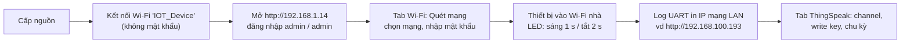

| Kiểu nháy LED | Ý nghĩa |
|---|---|
| sáng 0,5 s · tắt 1 s | Chưa kết nối Wi-Fi |
| sáng 1 s · tắt 2 s | Đã kết nối, có địa chỉ IP |

---

## 2. Yêu cầu phần mềm

### 2.1 Danh sách yêu cầu

| ID | Yêu cầu |
|---|---|
| **SWR-01** | Thiết bị luôn phát điểm truy cập cấu hình `IOT_Device` (mở) với IP tĩnh `192.168.1.14/24`, không phụ thuộc kết nối station. |
| **SWR-02** | Mọi trang web và API đều yêu cầu HTTP Basic Auth (mặc định `admin`/`admin`). |
| **SWR-03** | Trang web quét và liệt kê các mạng Wi-Fi xung quanh; chọn một mạng thì hỏi mật khẩu rồi kết nối. Mạng ẩn nhập tay được. |
| **SWR-04** | Thông tin Wi-Fi lưu trong NVS và dùng lại sau khi khởi động. Mất kết nối thì tự kết nối lại sau 5 s. |
| **SWR-05** | LED nháy sáng 0,5 s / tắt 1 s khi chưa kết nối và sáng 1 s / tắt 2 s khi đã kết nối. |
| **SWR-06** | IP station được in ra log UART khi nhận được và nhắc lại mỗi 60 s. |
| **SWR-07** | Thông số ThingSpeak (bật/tắt, Channel ID, Write API Key, chu kỳ 5–3600 s) sửa được trên web và lưu NVS. |
| **SWR-08** | Trang web có chức năng *khởi động lại* và *khôi phục cài đặt gốc* (xoá cấu hình đã lưu). |
| **SWR-09** | Trang web dùng được trên điện thoại và máy tính khi không có Internet (không dùng CDN). |
| **SWR-10** | Việc lấy mẫu được điều khiển bởi ISR timer phần cứng và event của task. Hết mỗi chu kỳ, số đo của **cả hai** cảm biến được gom thành **một** object. |
| **SWR-11** | Mỗi kênh đo được lọc (kiểm tra dải → median 5 → EMA) để loại gai nhiễu mà vẫn giữ độ trễ không đổi khi dữ liệu tăng/giảm tuyến tính. |
| **SWR-12** | Object được xếp vào pool cố định 32 phần tử. Pool đầy thì bỏ object **cũ nhất** để dữ liệu luôn mới. |
| **SWR-13** | Worker gửi dữ liệu được đánh thức mỗi 1 s bởi ISR timer và khi có dữ liệu mới, tuân thủ giới hạn ThingSpeak 1 lần/15 s, gửi toàn bộ object đang chờ kèm thời điểm đo thật. |
| **SWR-14** | Có tuỳ chọn build thay việc đọc cảm biến bằng tín hiệu giả tăng/giảm đều để kiểm thử khi chưa có phần cứng. |

### 2.2 Ràng buộc và quyết định thiết kế

| ID | Quyết định | Lý do |
|---|---|---|
| DEC-01 | Chỉ cấu hình Wi-Fi qua web; đã bỏ SmartConfig. | Quyết định sản phẩm, chỉ giữ một luồng cấu hình. |
| DEC-02 | AP luôn bật ở chế độ APSTA kể cả khi station đã kết nối. | Trang web luôn truy cập được. lwIP định tuyến theo IP nguồn nên dải AP trùng mạng nhà `192.168.1.x` vẫn hoạt động. |
| DEC-03 | Gửi bằng **bulk update** của ThingSpeak kèm `created_at`. | Tài khoản miễn phí chỉ nhận 1 lần/15 s; bulk update không mất dữ liệu khi chu kỳ ngắn hơn hoặc mạng bị gián đoạn. |
| DEC-04 | Ánh xạ field tạm hardcode (`FIELD_MAP`). | Sẽ cho cấu hình trên web sau. |
| DEC-05 | Bí mật (API key, Wi-Fi mặc định) nằm trong `sdkconfig.secrets` (git bỏ qua). | Không để thông tin đăng nhập trong repository. |

---

## 3. Kiến trúc phần mềm

### 3.1 Ngữ cảnh hệ thống

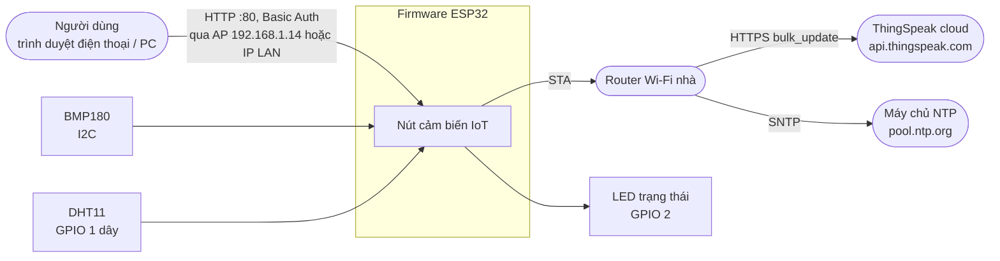

### 3.2 Góc nhìn tĩnh — component và phân lớp

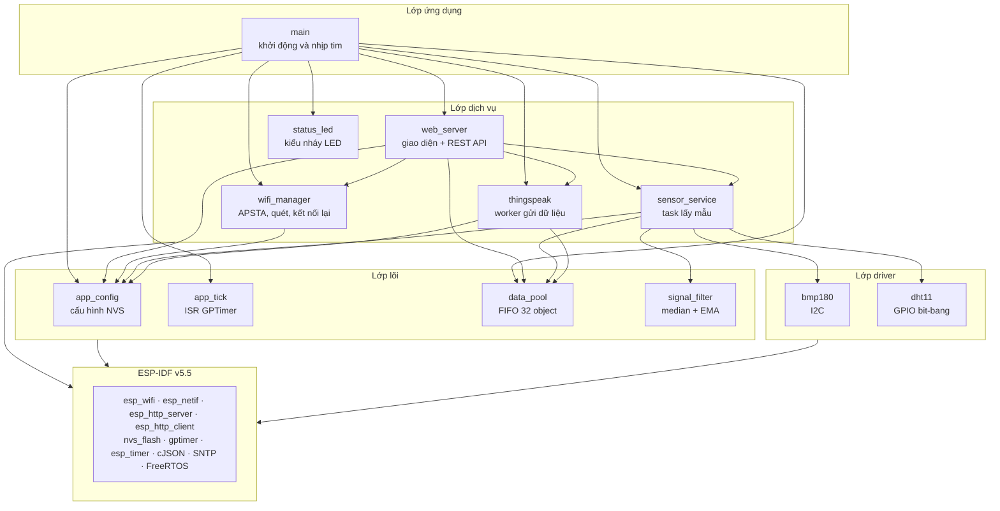

| Component | Trách nhiệm | Giao tiếp chính |
|---|---|---|
| `main` | Khởi tạo component theo thứ tự, nối callback, log nhịp tim mỗi 60 s | `app_main()` |
| `app_config` | Đọc/ghi cấu hình Wi-Fi và ThingSpeak trong NVS, mặc định từ Kconfig | `app_config_get_*/set_*`, `app_config_factory_reset` |
| `app_tick` | GPTimer phần cứng, ISR notify các task đã đăng ký | `app_tick_subscribe`, `app_tick_start` |
| `sensor_service` | Đọc cảm biến mỗi tick, lọc, đóng gói một object mỗi chu kỳ | `sensor_service_start`, `sensor_service_get_latest` |
| `signal_filter` | Mỗi kênh: kiểm tra dải → median 5 → EMA | `signal_filter_update/get/reset` |
| `data_pool` | Bộ đệm vòng tĩnh 32 `sensor_sample_t`, bỏ cũ nhất | `data_pool_push/peek/release/get_stats` |
| `thingspeak` | Worker gửi dữ liệu, SNTP, bulk/single update | `thingspeak_worker_start`, `thingspeak_get_status` |
| `wifi_manager` | APSTA, IP tĩnh cho AP, timer kết nối lại, quét, kết nối | `wifi_manager_start/connect/scan/get_status` |
| `web_server` | Trang web nhúng và REST API có Basic Auth | `web_server_start` |
| `status_led` | Kiểu nháy LED chạy bằng `esp_timer` | `status_led_set_mode` |
| `bmp180`, `dht11` | Driver cảm biến | `bmp180_read_*`, `dht11_read` |

### 3.3 Góc nhìn động — task và event

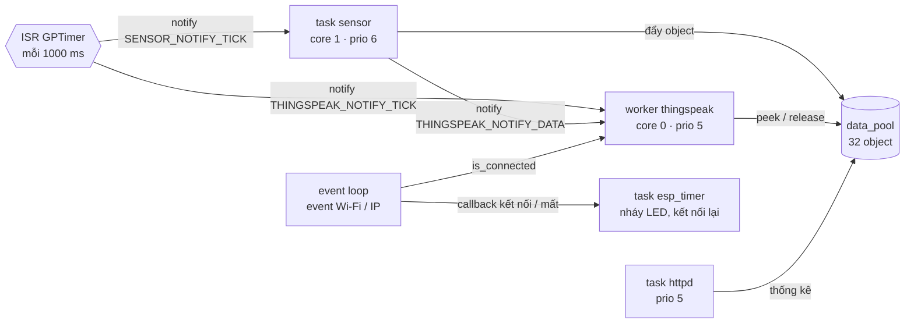

| Ngữ cảnh thực thi | Core | Priority | Stack | Được đánh thức bởi |
|---|---|---|---|---|
| ISR GPTimer (`app_tick`) | — | ISR | — | Alarm phần cứng mỗi `APP_TICK_PERIOD_MS` |
| Task `sensor` | 1 | 6 | 4 KB | `SENSOR_NOTIFY_TICK` |
| Task `thingspeak` | 0 | 5 | 8 KB | `THINGSPEAK_NOTIFY_TICK` \| `THINGSPEAK_NOTIFY_DATA` |
| Task `httpd` | — | 5 | 8 KB | Request HTTP |
| Event loop mặc định | 0 | 20 | IDF | Event Wi-Fi / IP (handler của `wifi_manager`) |
| Task `esp_timer` | 0 | 22 | IDF | Nháy LED, timer kết nối lại 5 s, timer khởi động lại |
| Task `main` | 0 | 1 | IDF | Nhịp tim mỗi 60 s |

> [!NOTE]
> Task sensor chạy trên **core 1** vì khung dữ liệu DHT11 được đọc trong vùng critical
> (~4,5 ms, tắt ngắt trên core đó). Ngắt Wi-Fi nằm ở core 0 nên không bị trễ.

### 3.4 Tài nguyên dùng chung

| Tài nguyên | Ghi | Đọc | Bảo vệ |
|---|---|---|---|
| Bộ đệm vòng `data_pool` | task sensor | worker, httpd | Mutex FreeRTOS |
| Bộ nhớ đệm cấu hình | httpd | sensor, worker, wifi_manager | Mutex FreeRTOS |
| Object mới nhất | task sensor | httpd | Spinlock |
| Trạng thái Wi-Fi | event loop, httpd | worker, httpd, main | Spinlock |
| Trạng thái ThingSpeak | worker | httpd | Spinlock |
| Thao tác quét / kết nối | httpd | — | Mutex (`s_op_lock`) |

### 3.5 Trình tự khởi động

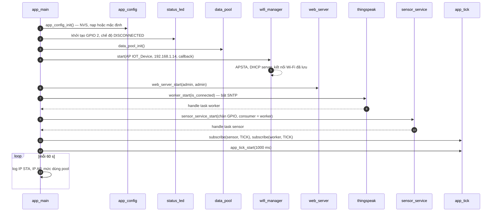

### 3.6 Luồng dữ liệu đầu cuối

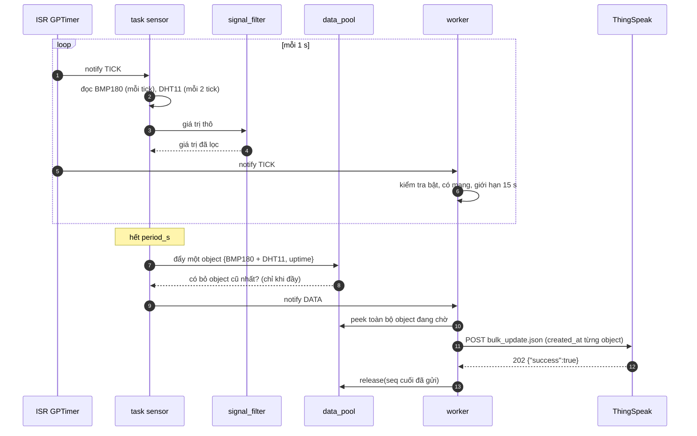

---

## 4. Thiết kế chi tiết

### 4.1 `app_tick` — nguồn thời gian

- Một GPTimer độ phân giải 1 MHz, alarm tự nạp lại sau `period_ms × 1000` xung.
- ISR `tick_isr()` gọi `xTaskNotifyFromISR(task, bits, eSetBits)` cho tối đa 4 task đăng ký và
  yield nếu đánh thức task có priority cao hơn.
- ISR không làm việc nặng; I2C, DHT11 và HTTP đều chạy trong task.

### 4.2 `sensor_service` — lấy mẫu theo tick

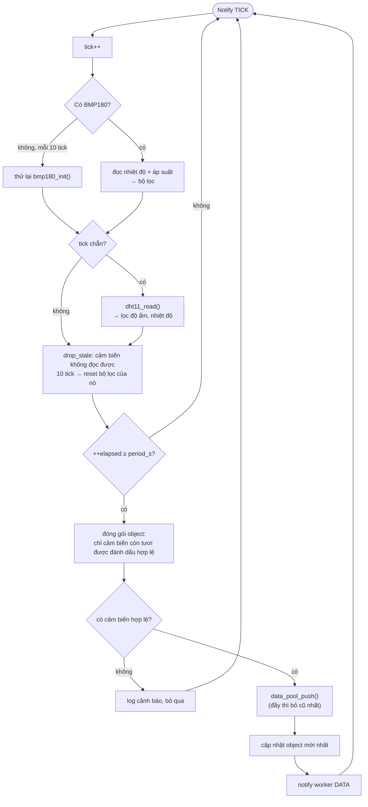

Object dữ liệu (`sensor_sample_t`, `lib/data_pool/data_pool.h`):

| Trường | Đơn vị | Nguồn |
|---|---|---|
| `seq` | — | Pool gán, tăng dần |
| `uptime_us` | µs | `esp_timer_get_time()` lúc đóng gói |
| `valid` | bit mask | `SAMPLE_VALID_BMP180`, `SAMPLE_VALID_DHT11` |
| `bmp_temperature_c` | °C | BMP180, đã lọc |
| `pressure_hpa` | hPa | BMP180, đã lọc |
| `altitude_m` | m | tính từ áp suất đã lọc và áp suất mực nước biển |
| `humidity_percent` | %RH | DHT11, đã lọc |
| `dht_temperature_c` | °C | DHT11, đã lọc |

**Chế độ dữ liệu giả** (`CONFIG_APP_SENSOR_FAKE_DATA`): thay việc đọc cảm biến bằng sóng tam giác
chu kỳ 120 tick — nhiệt độ 20 → 35 → 20 °C, áp suất 1000 → 1020 hPa, độ ẩm 40 → 80 %RH,
nhiệt độ DHT = nhiệt độ − 0,5 °C. Có thêm nhiễu nhỏ (±0,1 °C, ±5 Pa, ±0,3 %RH) và gai nhiễu mỗi
25 tick (+8 °C, +400 Pa, +5 %RH). Dữ liệu đi qua đúng bộ lọc thật.

### 4.3 `signal_filter` — bộ lọc nhiễu

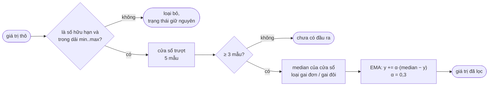

| Kênh | Dải hợp lệ | α |
|---|---|---|
| Nhiệt độ BMP180 | −40 … 85 °C | 0,3 |
| Áp suất BMP180 | 30 000 … 110 000 Pa | 0,3 |
| Nhiệt độ DHT11 | 0 … 50 °C | 0,3 |
| Độ ẩm DHT11 | 0 … 100 %RH | 0,3 |

Với dữ liệu tăng/giảm tuyến tính, median trễ 2 mẫu và EMA trễ ≈ 2,3 mẫu, nên đầu ra là bản sao
song song, trễ đều của đầu vào (trễ ≈ 1,1 °C ở độ dốc 0,25 °C/mẫu, như nhau khi tăng và khi giảm).

### 4.4 `data_pool` — FIFO bỏ object cũ nhất

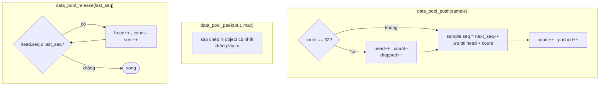

- Bộ nhớ tĩnh, không dùng `malloc`. Mọi thao tác được bảo vệ bằng một mutex.
- `peek` + `release(seq)` cho phép worker gửi mà không giữ khoá trong lúc chờ HTTP. Object bị bỏ
  trong lúc đang gửi vẫn được xử lý đúng vì `release` so sánh theo số thứ tự.

### 4.5 `thingspeak` — worker gửi dữ liệu

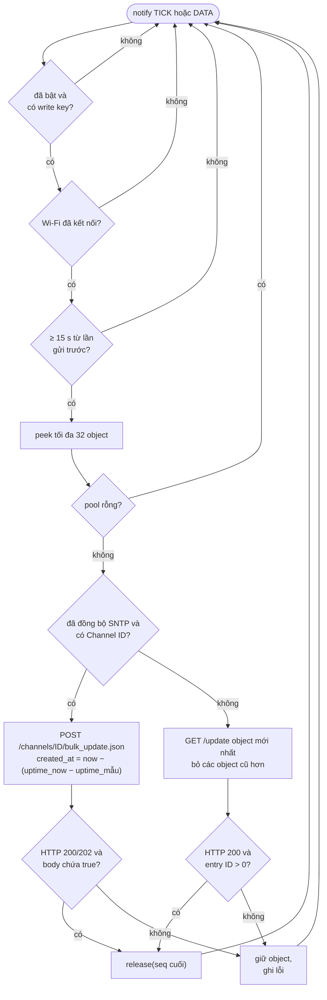

Ánh xạ field (`FIELD_MAP` trong `lib/thingspeak/thingspeak.c`):

| Field ThingSpeak | Giá trị |
|---|---|
| field1 | Nhiệt độ BMP180 (°C) |
| field2 | Áp suất (hPa) |
| field3 | Độ ẩm DHT11 (%RH) |
| field4 | Nhiệt độ DHT11 (°C) |

Field của cảm biến không hợp lệ sẽ không được gửi.

### 4.6 `wifi_manager` — máy trạng thái station

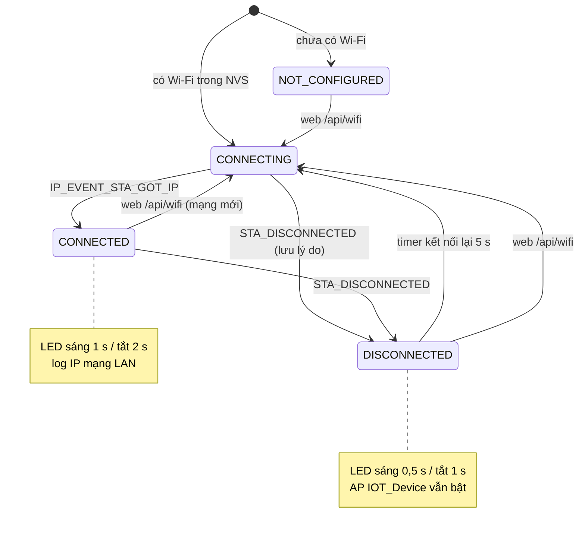

- Interface AP được cấu hình trước `esp_wifi_start()`: dừng DHCP server, đặt IP tĩnh, bật lại DHCP server.
- **Quét mạng**: khi chưa kết nối thì tạm dừng vòng kết nối lại (driver từ chối quét khi đang
  kết nối), quét đồng bộ (~3 s), sau đó kết nối lại.
- **Kết nối từ web**: lưu NVS trước, ngắt kết nối hiện tại và chờ event disconnect (≤ 1 s) để event
  cũ không lên lịch kết nối lại sai.

Trình tự cấu hình Wi-Fi từ trang web:

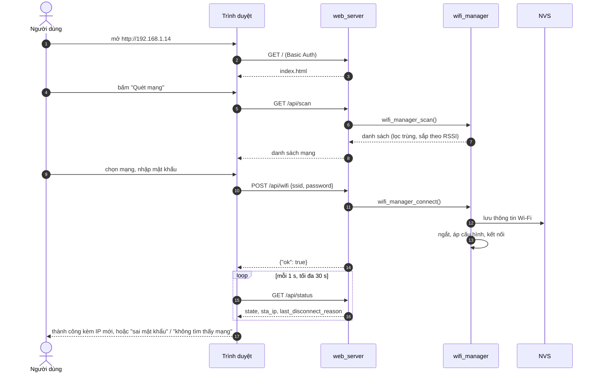

### 4.7 `web_server` — REST API

Mọi URI yêu cầu `Authorization: Basic …`; nếu không trả `401` kèm `WWW-Authenticate` để trình
duyệt hiện hộp đăng nhập. Body request giới hạn 512 byte.

| Method | URI | Body / kết quả |
|---|---|---|
| GET | `/` | `index.html` nhúng (~19 KB, không tài nguyên ngoài) |
| GET | `/api/status` | Wi-Fi, object mới nhất, thống kê pool, trạng thái ThingSpeak, uptime, heap trống |
| GET | `/api/scan` | `[{ssid, rssi, channel, secure}]`, tối đa 20, mạnh nhất trước |
| POST | `/api/wifi` | `{ssid, password}` — mật khẩu rỗng hoặc 8–64 ký tự |
| GET | `/api/thingspeak` | `{enabled, channel_id, write_api_key, period_s, min/max_period_s, min_send_interval_s}` |
| POST | `/api/thingspeak` | Cùng các trường; trường thiếu giữ nguyên; `400` nếu không hợp lệ |
| POST | `/api/reboot` | Khởi động lại sau 1 s |
| POST | `/api/factory-reset` | Xoá namespace NVS `app_cfg`, khởi động lại sau 1 s |

### 4.8 `app_config` — cấu hình lưu trữ

| NVS namespace `app_cfg` | Kiểu | Nội dung |
|---|---|---|
| `wifi` | blob | `app_wifi_config_t {ssid[33], password[65]}` |
| `thingspeak` | blob | `app_thingspeak_config_t {enabled, channel_id, write_api_key[17], period_s}` |

Thứ tự ưu tiên: **giá trị NVS → mặc định Kconfig (`sdkconfig.secrets`) → mặc định trong code**.
Write key chỉ gồm chữ và số vì được ghép thẳng vào URL.

### 4.9 `status_led` và `dht11`

- `status_led`: một `esp_timer` one-shot được hẹn lại theo thời gian sáng/tắt của kiểu nháy hiện
  tại. Khi đổi chế độ, chu kỳ được khởi động lại trong task timer nên GPIO không bị đảo song song.
- `dht11`: xung bắt đầu 18 ms chạy khi ngắt vẫn bật; phần phản hồi và 40 bit dữ liệu (~4,5 ms)
  được đọc trong `portENTER_CRITICAL` để ngắt Wi-Fi không làm sai độ rộng xung. Checksum được kiểm
  tra sau khi ra khỏi vùng critical.

---

## 5. Tham chiếu cấu hình

`idf.py menuconfig` → **IoT Device Configuration** (giá trị thật đặt trong `sdkconfig.secrets`):

| Tuỳ chọn | Mặc định | Mô tả |
|---|---|---|
| `APP_AP_SSID` | `IOT_Device` | Tên AP cấu hình (mở) |
| `APP_AP_IP` | `192.168.1.14` | IP tĩnh của AP, /24 |
| `APP_WEB_USERNAME` / `APP_WEB_PASSWORD` | `admin` / `admin` | Tài khoản web |
| `APP_STATUS_LED_GPIO` | `2` | LED trạng thái |
| `APP_DEFAULT_PERIOD_S` | `20` | Chu kỳ lấy mẫu = chu kỳ gửi (5–3600 s) |
| `APP_DEFAULT_TS_ENABLED` / `_CHANNEL_ID` / `_WRITE_KEY` | tắt / 0 / rỗng | Mặc định ThingSpeak |
| `APP_DEFAULT_WIFI_SSID` / `_PASSWORD` | rỗng | Chỉ dùng khi NVS chưa có Wi-Fi |
| `APP_SENSOR_FAKE_DATA` | bật trong `sdkconfig.defaults` | Dữ liệu giả, không cần cảm biến |

Menu khác: **BMP180 Configuration** (SDA, SCL, áp suất mực nước biển), **ThingSpeak Configuration**
(GPIO DHT11).

Hằng số lúc biên dịch:

| Hằng số | File | Giá trị | Ghi chú |
|---|---|---|---|
| `APP_TICK_PERIOD_MS` | `main/main.c` | 1000 | Các hằng tính theo tick bên dưới giả định 1 tick = 1 s |
| `DHT11_READ_EVERY_TICKS` | `lib/sensor_service/sensor_service.c` | 2 | DHT11 cần ≥ 2 s giữa hai lần đọc |
| `STALE_TICKS`, `BMP180_RETRY_TICKS` | `lib/sensor_service/sensor_service.c` | 10 | Coi cảm biến mất / chu kỳ thử khởi tạo lại |
| `FILTER_ALPHA` | `lib/sensor_service/sensor_service.c` | 0.3 | Hệ số làm mượt EMA |
| `DATA_POOL_CAPACITY` | `lib/data_pool/data_pool.h` | 32 | Kích thước pool |
| `THINGSPEAK_MIN_INTERVAL_MS` | `lib/thingspeak/thingspeak.h` | 15000 | Giới hạn tài khoản miễn phí |

### Cấu trúc thư mục

```text
esp32-bmp180/
├── main/                 app_main, Kconfig
├── lib/
│   ├── app_config/       cấu hình NVS
│   ├── app_tick/         tick ISR GPTimer
│   ├── data_pool/        FIFO 32 object
│   ├── signal_filter/    median + EMA
│   ├── sensor_service/   task lấy mẫu (+ dữ liệu giả)
│   ├── thingspeak/       worker gửi dữ liệu
│   ├── wifi_manager/     APSTA, quét, kết nối lại
│   ├── web_server/       REST API + web/index.html
│   ├── status_led/       kiểu nháy LED
│   ├── bmp180/, dht11/   driver
├── partitions.csv        app factory 2 MB
├── sdkconfig.defaults    mặc định được commit
└── sdkconfig.secrets     bí mật local (git bỏ qua)
```
